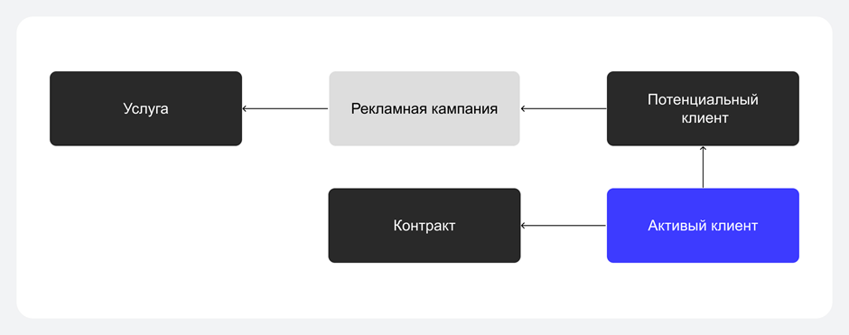
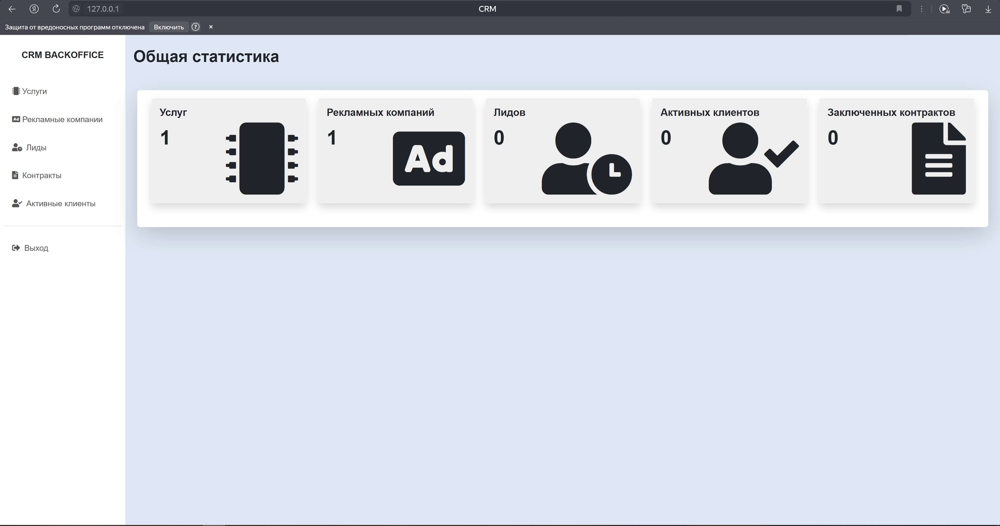

<h1 style="color: lightgreen;"> crm_system </h1>
<h2 style="color: yellow;">Описание проекта:</h2>

CRM-система в виде веб-приложения для управлдения клиентами

Основные функции приложения:

<ol>
    <li>
    Авторизация пользователя
    </li>
    <li>
    Создание, редактирование, удаление и просмотр предоставляемых услуг
    </li>
    <li>
    Создание, редактирование, удаление и просмотр рекламных компаний
    </li>
    <li>
    Создание, редактирование, удаление и просмотр потенциальных клиентов
    </li>
    <li>
    Создание, редактирование, удаление и просмотр контрактов
    </li>
    <li>
    Перевод потенциального клиента в активный
    </li>
    <li>
    Подсчет и отображение статистики по рекламным компаниям: сколько 
    привлечено потенциальных клиентов, сколько из них перешло в активных
    </li>
</ol>

<h2 style="color: yellow;">Структура проекта:</h2>
<ul>
<li>
crm - Приложение написанное на django
</li>
<li>
frontend - Веб-сервер Nginx для отдачи статики и проксирования запросов на django приложения
</li>
<li>
migrations - Миграции базы данных
</li>
<li>
requirements - Зависимости приложения django
</li>
<li>
docker-compose.yml - Сборка контейнеров для развертывания:
    <ul>
        <li>
        database - База данных postgres
        </li>
        <li>
        frontend - Веб сервер Nginx
        </li>
        <li>
        app - django приложение
        </li>
    </ul>
</li>
</ul>

<h2 style="color: yellow;">Переменные окружения</h2>
<h3>Условно переменные окружения можно разделить на три группы</h3>
<ul>
    <li>
        Переменные для базы Данных:
        <ul>
            <li>
            DB_USER - Имя пользователя
            </li>
            <li>
            DB_PASS - Пароль пользователя
            </li>
            <li>
            DB_NAME - Название базы данных
            </li>
            <li>
            DB_PORT - Порт для подключения к базе данных
            </li>
            <li>
            DB_HOST - Хост для подключения к базе данных
            </li>
        </ul>
    </li>
    <li>
        Переменные для создания суперпользователя
        <ul>
            <li>
            USER - Имя пользователя
            </li>
            <li>
            PASS - Пароль пользователя
            </li>
            <li>
            EMAIL - Электронный адресс пользователя
            </li>
        </ul>
    </li>
    <li>
        Переменные для конфигурации приложения
        <ul>
            <li>
            SECRET_KEY - Секретный ключ для подключения к приложению
            </li>
            <li>
            DJANGO_DEBUG - Уровень логирования приложения
            </li>
        </ul>
    </li>
</ul>

<h2 style="color: yellow;">База данных</h2>
<h4>СУБД приложения - Postgres. Подключение к СУБД - синхронное</h4>

Структура моделей БД:

<ul>
    <li>
        <b style="color: green">products</b> - Таблица с услугами
        <ul>
            <li>
            name - Название услуги
            </li>
            <li>
            description - Описание услуги
            </li>
            <li>
            cost - Цена услуги
            </li>
        </ul>
    </li>
    <li>
        <b style="color: green">advertisements</b> - Таблица с рекламными компаниями
        <ul>
            <li>
            name - Название рекламной компании
            </li>
            <li>
            budget - Стоимость рекламной компании
            </li>
            <li>
            leads_count - Количество клиентов привлеченных этой рекламной компанией
            </li>
            <li>
            customers_count - Количество активных клиентов привлеченных этой рекламной компанией
            </li>
            <li>
            profit - Доход от рекламной компании
            </li>
            <li>
            ads_product - Услуга на которую ссылается рекламная компания
            </li>
        </ul>
    </li>
    <li>
        <b style="color: green">contracts</b> - Таблица с заключенными контрактами
        <ul>
            <li>
            name - Название контракта
            </li>
            <li>
            start_date - Дата заключения контракта
            </li>
            <li>
            end_date - Дата окончания контракта
            </li>
            <li>
            cost - Стоимость заключения контракта
            </li>
            <li>
            customer - Ссылка на активного клиента с которым заключается контракт
            </li>
            <li>
            product - Ссылка на услугу по которой заключается контракт
            </li>
            <li>
            contract - Файл с контрактом
            </li>
        </ul>
    </li>
    <li>
        <b style="color: green">customers</b> - Таблица с потенциальными клиентами
        <ul>
            <li>
            lead - Ссылка на потенциального клиента
            </li>
        </ul>
    </li>
    <li>
        <b style="color: green">leads</b> - Таблица с активными клиентами
        <ul>
            <li>
            last_name - Фамилия потенциального клиента
            </li>
            <li>
            first_name - Имя потенциального клиента
            </li>
            <li>
            email - Електронный адрес потенциального клиента
            </li>
            <li>
            phone - мобильный телефон потенциального клиента
            </li>
            <li>
            ads - Ссылка на рекламу которая привлекла потенциального клиента
            </li>
        </ul>
    </li>
</ul>

Зависимости объектов

<h2 style="color: yellow;">Права доступа и пользователи</h2>

Приложение иммет авторизацию и аутентификацию по имени и паролю. 
При первом старте приложения создается суперпользователь который
имеет все права доступа. Суперпользователь имеет право создавать других
пользователей и назначать им права доступа. В случае если пользователь не имеет
соответствующего разрешения он будет перенаправлен на страницу 403 Forbidden.

Добавление других пользователей осуществляется через admin панель в django
по адресу <a href="http://127.0.0.1:80/admin/">http://127.0.0.1:80/admin/</a>

<h2 style="color: lightblue;">Первый старт сервиса</h2>

1) Убедитесь что у вас установлен Docker

2) Подготовьте файл с переменным окружения ".env" в корне проекта указав в этом файле
значения переменных приведенных в ".env.template"

3) Запустите приложение команлдой docker compose up

4) Приложение будет доступно по адресу <a href="http://127.0.0.1:80/">http://127.0.0.1:80/</a>

5) После авторизации пользователя в браузере отобразится веб-страница:

<h2 style="color: yellow;">Несколько заметок при использовании сервиса</h2>

При редактировании стоимости контракта, редактируется и статистика рекламы.
 

При выборе другого файла для контракта, старый файл удаляется новый записывается.

При удалении пользователя или перевода его в статус активный также редактируется статистика.

Подсчет статистики для рекламы реализовано через отношение суммы всех контрактов связанных 
с определенной рекламой к сумме на услугу и затраты этой же рекламы.

